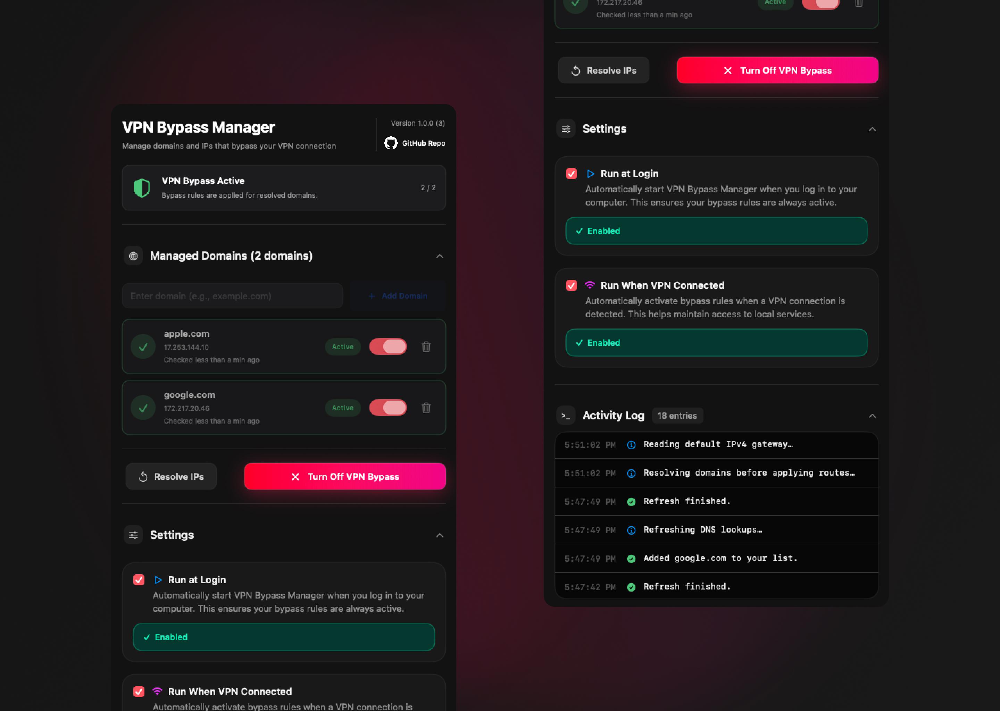

# VPN Bypass

A native **macOS** utility built with **Swift** and **SwiftUI** for advanced users who want traffic to **specific hostnames** to follow the system’s **current IPv4 default gateway** instead of a VPN’s default route—when that routing table layout makes sense for your network. The app resolves domains, then adds or removes **per-host IPv4 routes** via a bundled **`bypass_routes.sh`** script (wrapped for privilege elevation).



## Requirements

- macOS **13.0** (Ventura) or newer  
- Xcode **15** or newer (recommended)  
- Administrator authorization when applying or removing routes (see [Permissions and security](#permissions-and-security))

## Open and build

1. Open `VPNBypass.xcodeproj` in Xcode.  
2. Select the **VPNBypass** scheme and **My Mac**.  
3. **Product → Run** (⌘R).

The project also defines a **VPNBypassRouteHelper** target (privileged helper executable). It is part of the optional XPC path described below; the default build path does not require a separate run configuration for day-to-day UI development.

### First-run data

On launch, the app ensures:

- **`~/Library/Application Support/com.vpnbypass.VPNBypass/state.json`** — domains, route bookkeeping, and settings  
- A copy of **`bypass_routes.sh`** in that folder (refreshed when the bundled script’s size changes)

Bundled hostnames from **`VPNBypass/Resources/default_domains.json`** are **merged on every launch**: new preset entries are added if missing; existing user domains and settings are **not** removed.

## How it works (short)

1. **Refresh** resolves each hostname to **IPv4** using system DNS (`getaddrinfo` with `AF_INET` in **`ResolverService`**).  
2. **Apply VPN Bypass** collects IPv4 addresses for domains **included** in routing (`DomainRecord.isIncludedInRoutes`), reads the **default IPv4 gateway** (script action **`gateway`**: `route -n get default`), then runs **`apply`**, which for each IP runs `route -n delete -host` (ignored if missing) and **`route -n add -host <ip> <gateway>`**.  
3. **Turn Off Bypass** runs **`remove`** to delete those host routes using the IPv4 list saved in **`RouteApplicationState`**.  
4. The UI shows resolution status, addresses, whether the last apply appears to cover each domain, timestamps, activity logs, and settings (login item, auto-apply on VPN heuristic).

## Architecture

The codebase is organized into four conceptual layers plus shared routing infrastructure.

### Layers

| Layer | Role |
|--------|------|
| **Views** | SwiftUI screens and components (`ManagerView` and `Views/Manager/*`, `DomainRowView`, `LogsPanelView`). The app entry uses **`ManagerView`**; `MainView` remains in the project but is not the active root. |
| **ViewModels** | **`DomainListViewModel`** (`@MainActor`): owns user actions, loading state, logs, coordinates services, and maps persistence + resolution cache into **`DomainRowDisplay`** for the list. |
| **Services** | Side effects and integration: DNS resolution, route orchestration, script/XPC execution, VPN heuristic monitoring, login item registration, disk persistence. |
| **Models** | Pure types: **`AppPersistence`**, **`DomainRecord`**, **`RouteApplicationState`**, **`DomainValidation`**, **`DomainRowDisplay`**, **`LogEntry`**. |

### Key services

| Component | Responsibility |
|-----------|----------------|
| **`DomainStore`** | Loads/saves **`AppPersistence`** JSON; **`DefaultDomainsLoader`** merges **`default_domains.json`**; mutations for domains, route state, and settings. |
| **`ResolverService`** | Async IPv4 resolution via **`getaddrinfo`** (no shell `dig`). |
| **`RouteManager`** | Single entry for gateway probe and apply/remove; delegates privileged work to **`PrivilegedRouteExecuting`**. |
| **`ScriptRunner`** | Copies the bundled script to Application Support; runs **`gateway`** without elevation; runs **`apply`** / **`remove`** through **AppleScript** (`osascript` + `do shell script … with administrator privileges`). Implements **`PrivilegedRouteExecuting`**. |
| **`PrivilegedHelperClient`** | Alternative **`PrivilegedRouteExecuting`**: XPC to **`VPNBypassRouteHelper`**, JSON request/response (**`RouteXPCRequestBody`** / **`RouteXPCResultBody`**). No `osascript` in the app when this path is enabled. |
| **`RoutePrivilegedExecutorFactory`** | Selects **`ScriptRunner`** vs **`PrivilegedHelperClient`** from **`AppPrivilegedRoutingConfiguration.usePrivilegedHelper`**. |
| **`VPNMonitor`** | **`NWPathMonitor`** + interface-name heuristic (`utun`, `tun`/`tap`, `ppp`, `ipsec`) for “VPN likely”; drives optional auto-apply when enabled. |
| **`LoginItemManager`** | **`SMAppService.mainApp`** register/unregister for “run at login” (macOS 13+). |

Shared helpers live under **`PrivilegedRoutingShared/`** (XPC protocol/constants, payload types, **`RouteScriptProcessRunner`**).

### Data flow

```text
SwiftUI (ManagerView)
    → DomainListViewModel
        → DomainStore (read/write state.json)
        → ResolverService (DNS → IPv4)
        → RouteManager
            → PrivilegedRouteExecuting
                → ScriptRunner (bash + osascript)  OR  PrivilegedHelperClient (XPC)
                    → bypass_routes.sh → /sbin/route
    ← @Published / ObservableObject updates → UI
```

User toggles (per-domain inclusion, run at login, auto-apply on VPN) update persistence through the view model and store.

### How it affects macOS networking

**Host-specific routing**

The script installs **host routes** (`-host`): only packets destined to those exact IPv4 addresses use the supplied **next hop** (the gateway string from **`route -n get default`**). Other traffic follows the rest of the routing table unchanged.

**Relation to “bypassing” a VPN**

Many VPN clients install a **default route** (or otherwise attract traffic) through a tunnel interface (often **`utun*`**). A more specific **`route -n add -host`** entry can steer matching destinations out of the default path **if** the chosen gateway is reachable and correct for leaving via the physical LAN. The app **does not** enumerate Wi‑Fi/Ethernet separately; it uses whatever **`route -n get default`** reports. If the active default route is already the VPN, that gateway value may be **VPN-related**, and bypass may **not** behave like “always use the home router”—behavior is **setup-dependent**.

**Default gateway**

Gateway discovery is **`/sbin/route -n get default`** parsed for `gateway:`. Changing networks or VPN state after apply can make old host routes **stale** (wrong next hop or interface); re-apply after network changes when needed.

**Limitations and edge cases**

- **IPv4 only** — no IPv6 host routes; **`bypass_routes.sh`** skips non-IPv4 tokens.  
- **DNS-dependent** — routes target **resolved addresses**. CDNs or short TTLs can change A records; refresh and re-apply if IPs drift.  
- **VPN detection is a heuristic** — **`NWPathMonitor`** interface names are **not** a universal “VPN connected” API; false positives/negatives are possible.  
- **Route conflicts** — other software or scripts may add overlapping routes; **`apply`** deletes a matching host route before add, but unrelated changes can still surprise you.  
- **DNS leaks vs routing** — this tool adjusts **routing**; it does not replace system resolver policy. Understand your threat model if DNS privacy matters.  
- **VPN or OS updates** may reorder routes or replace behavior; treat bypass as **best-effort** for advanced users.

## Permissions and security

| Topic | Behavior in this version |
|--------|---------------------------|
| **Routing (default)** | **`route`** changes require **root**. **`ScriptRunner`** elevates via **AppleScript** (`osascript`), which triggers Apple’s standard **administrator** prompt **per elevated invocation** (each apply/remove is a new authorization workflow). |
| **Routing (optional)** | With **`AppPrivilegedRoutingConfiguration.usePrivilegedHelper = true`**, the app uses **XPC** to **`VPNBypassRouteHelper`**, which runs the same script **inside the helper**. Avoiding repeated prompts requires a **properly installed and blessed** helper (e.g. **SMJobBless** + signing). **`PrivilegedHelperServiceManager`** in the repo is a **stub**; full install wiring is **not** completed here. |
| **Sandbox** | **App Sandbox is disabled** in **`VPNBypass.entitlements`** so the app can run **`route`**, **`bash`**, and **`osascript`** in a typical local/developer-signed build. App Store distribution would need a different design (privileged helper, hardened constraints, etc.). |
| **Hardened Runtime** | Enabled in the Xcode project for the relevant targets. |
| **Login items** | **`SMAppService`** (`LoginItemManager`). The user may need to approve the app under **System Settings → General → Login Items** when status is **requiresApproval**. |

### Production-oriented follow-ups

- Finish **SMJobBless** (or equivalent) for **`VPNBypassRouteHelper`**, matching Team ID, embedded helper location, launchd plist, and Mach service name **`com.vpnbypass.VPNBypass.route-helper`** (**`RouteXPCConstants`**).  
- Keep **`usePrivilegedHelper`** as the single switch once install UX exists.  
- Add automated tests around **`DomainValidation`**, persistence encoding, and privileged executor selection / payload round-trips.

## VPN auto-apply

**Run when VPN connected** uses **`VPNMonitor`**: when the active path is satisfied and an interface name matches the documented patterns (`utun`, `tun`/`tap`, `ppp`, `ipsec`), the app treats that as **VPN likely**. On transition from **not likely → likely**, **`DomainListViewModel`** can trigger **Apply** automatically if the setting is enabled. This is **not** a vendor API; some VPNs will not match.

## Project layout

```
VPNBypass.xcodeproj/
VPNBypass/
  VPNBypassApp.swift              # App entry (@main); hosts DomainListViewModel
  Info.plist
  VPNBypass.entitlements
  Assets.xcassets/
  Models/                         # Persistence, domain, validation, row display, logs
  Services/                       # Store, resolver, routes, script/XPC, VPN monitor, login item
    PrivilegedRouting/            # Factory, client, configuration, SMJobBless scaffold
  ViewModels/                     # DomainListViewModel
  Views/                          # ManagerView (primary UI), Manager/*, rows, logs
  Resources/
    bypass_routes.sh
    default_domains.json
  PrivilegedRoutingShared/        # XPC wire types, protocol, process runner
VPNBypassRouteHelper/             # Privileged helper target (XPC listener + command handler)
```
## License

This project is licensed under the **GPL-3.0 (GNU General Public License v3.0)**.

See the [LICENSE](./LICENSE) file for details.
